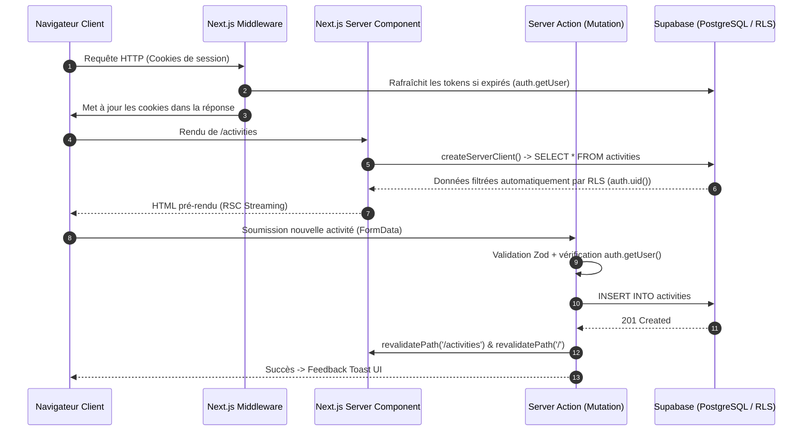
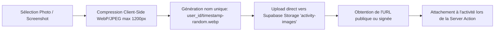

# Architecture Technique & Guide d'Implémentation — Metrik

> **Rôle :** Tech Lead & Senior Software Architect  
> **Statut :** Architecture de référence  
> **Stack Principale :** Next.js 15+ (App Router, React 19) • TypeScript (Strict) • Tailwind CSS • shadcn/ui • Supabase (Auth, Postgres, Storage) • Recharts  

---

## 1. Vue d'Ensemble & Choix d'Ingénierie

Metrik est architecturé comme une application web hybride tirant parti de **Next.js App Router** et de la puissance de **Supabase (Backend-as-a-Service)**.

### 1.1 Principes Directeurs
1. **Server-First par défaut (RSC) :** Les pages et composants effectuent leurs requêtes de données directement sur le serveur via les Server Components de Next.js, éliminant les cascades d'appels réseau (waterfalls) côté client et réduisant le bundle JavaScript envoyé au navigateur.
2. **Mutations déclaratives et typées (Server Actions) :** Toutes les mutations de données (création d'activité, log de poids, log de repas) sont exécutées via des Server Actions protégées par un schéma Zod et validées en amont.
3. **Sécurité en profondeur (Defense in Depth) :** Bien que le middleware et les Server Actions vérifient la session utilisateur, la sécurité fondamentale repose sur les politiques **PostgreSQL Row Level Security (RLS)**. Même en cas de bug applicatif, un utilisateur ne peut physiquement accéder ou modifier que ses propres données.
4. **Zéro sur-ingénierie d'état client :** Pas de store global lourd (Redux, MobX). L'état serveur est géré par la revalidation Next.js (`revalidatePath` / `revalidateTag`), et l'état UI éphémère (modales, filtres) par des hooks React locaux (`useState`, `useOptimistic`).

---

## 2. Arborescence du Projet

```text
metrik/
├── app/                                 # Routes Next.js (App Router)
│   ├── (auth)/                          # Groupe de routes publiques d'authentification
│   │   ├── login/
│   │   │   └── page.tsx                 # Formulaire de connexion (Email/MDP + Magic Link)
│   │   ├── register/
│   │   │   └── page.tsx                 # Formulaire de création de compte
│   │   └── layout.tsx                   # Layout centré et épuré pour l'auth
│   ├── (dashboard)/                     # Groupe de routes protégées (Session requise)
│   │   ├── layout.tsx                   # Shell applicatif (Sidebar, Topbar, ThemeToggle)
│   │   ├── page.tsx                     # Dashboard central (KPIs, Heatmap, Courbe poids)
│   │   ├── activities/
│   │   │   ├── page.tsx                 # Feed des activités sportives (vue Airbnb/immo)
│   │   │   └── loading.tsx              # Skeleton loader du feed
│   │   ├── nutrition/
│   │   │   └── page.tsx                 # Journal alimentaire décomplexé & balance
│   │   ├── weight/
│   │   │   └── page.tsx                 # Historique détaillé des pesées et projections
│   │   └── profile/
│   │       └── page.tsx                 # Paramètres physiques, BMR, et préférences
│   ├── api/                             # Endpoints API Route Handlers (si webhooks/export)
│   │   └── auth/callback/
│   │       └── route.ts                 # Handler d'échange de code OAuth / Magic Link
│   ├── layout.tsx                       # Root Layout (Theme provider, Fonts, Toaster)
│   ├── globals.css                      # Variables CSS, Tailwind directives & palette
│   └── not-found.tsx                    # Page 404 customisée
├── components/                          # Composants React modulaires
│   ├── ui/                              # Primitives UI shadcn/ui (Button, Card, Dialog, etc.)
│   │   ├── button.tsx
│   │   ├── dialog.tsx
│   │   ├── input.tsx
│   │   ├── select.tsx
│   │   ├── badge.tsx
│   │   └── ...
│   ├── dashboard/                       # Composants spécifiques au Dashboard
│   │   ├── metrics-cards.tsx            # KPIs (Dernier poids, delta 7j, bilan calorique)
│   │   ├── weight-chart.tsx             # Courbe Recharts avec moyenne mobile 7j
│   │   ├── activity-heatmap.tsx         # Calendrier façon GitHub (52 semaines)
│   │   └── weekly-calorie-bar.tsx       # Graphique comparatif dépenses vs apports
│   ├── activities/                      # Composants du module Activités
│   │   ├── activity-card.tsx            # Carte horizontale style Airbnb / plateforme immo
│   │   ├── activity-feed.tsx            # Liste paginée / infinie avec filtres
│   │   ├── activity-dialog.tsx          # Modal de création/édition d'activité
│   │   ├── realtime-met-calculator.tsx  # Calculateur en direct (MET x Poids x Durée)
│   │   └── image-uploader.tsx           # Upload de screenshot Strava / photo vers Storage
│   ├── nutrition/                       # Composants du module Nutrition
│   │   ├── meal-dialog.tsx              # Modal d'ajout rapide de repas
│   │   ├── meal-item.tsx                # Ligne de repas avec suppression/édition
│   │   └── daily-balance-gauge.tsx      # Jauge interactive de balance énergétique
│   ├── weight/                          # Composants du module Poids
│   │   ├── quick-weight-dialog.tsx      # Modal de pesée rapide en 1 clic
│   │   └── weight-table.tsx             # Historique tabulaire des pesées
│   └── shared/                          # Composants transverses
│       ├── app-sidebar.tsx              # Navigation latérale responsive (Desktop/Mobile)
│       ├── user-menu.tsx                # Menu avatar, profil, déconnexion
│       └── theme-toggle.tsx             # Bouton switch Light / Dark mode
├── lib/                                 # Utilitaires, clients et fonctions pures
│   ├── supabase/                        # Intégration Supabase SSR
│   │   ├── client.ts                    # Client Supabase pour Client Components (browser)
│   │   ├── server.ts                    # Client Supabase pour Server Components / Actions
│   │   └── middleware.ts                # Logique de rafraîchissement de session cookie
│   ├── calculations/                    # Logique métier et formules mathématiques
│   │   ├── bmr.ts                       # Formule Mifflin-St Jeor & TDEE
│   │   ├── mets.ts                      # Formules METs et fourchettes caloriques (±10%)
│   │   └── moving-average.ts            # Calcul de moyenne mobile 7 jours
│   ├── validations/                     # Schémas de validation Zod
│   │   ├── activity.schema.ts
│   │   ├── weight.schema.ts
│   │   ├── meal.schema.ts
│   │   └── profile.schema.ts
│   └── utils.ts                         # Helper cn() pour clsx et tw-merge, formateurs de date
├── hooks/                               # Custom Hooks React
│   ├── use-current-profile.ts           # Profil utilisateur en cache mémoire
│   └── use-media-query.ts               # Détection responsive mobile/desktop
├── types/                               # Définitions TypeScript
│   ├── database.types.ts                # Types générés directement depuis le schéma Supabase
│   └── domain.ts                        # Types métier composites (SportWithActivity, etc.)
├── actions/                             # Server Actions (Mutations Next.js)
│   ├── activities.actions.ts            # createActivity, deleteActivity, updateActivity
│   ├── weight.actions.ts                # logWeight, deleteWeightLog
│   ├── nutrition.actions.ts             # logMeal, deleteMealLog
│   └── profile.actions.ts               # updateProfile, calculateGoals
├── middleware.ts                        # Middleware global de routage et session Supabase
├── public/                              # Assets statiques (illustrations sports, favicons)
│   └── images/sports/                   # Images fallback sports (padel.webp, etc.)
├── tailwind.config.ts                   # Configuration du design system et couleurs
├── tsconfig.json                        # Configuration TypeScript stricte
└── package.json                         # Dépendances du projet
```

---

## 3. Architecture d'Intégration Supabase SSR

L'authentification et les échanges de données reposent sur le package officiel `@supabase/ssr`, qui stocke les tokens JWT dans des cookies HTTP sécurisés (`HttpOnly`, `SameSite=Lax`).



### 3.1 Client Browser (`lib/supabase/client.ts`)
Utilisé exclusivement dans les Client Components (`"use client"`) pour les uploads directs d'images vers Supabase Storage ou les écoutes Realtime.
```typescript
import { createBrowserClient } from '@supabase/ssr';
import type { Database } from '@/types/database.types';

export function createClient() {
  return createBrowserClient<Database>(
    process.env.NEXT_PUBLIC_SUPABASE_URL!,
    process.env.NEXT_PUBLIC_SUPABASE_ANON_KEY!
  );
}
```

### 3.2 Client Server (`lib/supabase/server.ts`)
Utilisé dans les Server Components, Route Handlers et Server Actions pour interroger la base avec le contexte utilisateur sans exposer les clés secrètes.
```typescript
import { createServerClient } from '@supabase/ssr';
import { cookies } from 'next/headers';
import type { Database } from '@/types/database.types';

export async function createClient() {
  const cookieStore = await cookies();

  return createServerClient<Database>(
    process.env.NEXT_PUBLIC_SUPABASE_URL!,
    process.env.NEXT_PUBLIC_SUPABASE_ANON_KEY!,
    {
      cookies: {
        getAll() {
          return cookieStore.getAll();
        },
        setAll(cookiesToSet) {
          try {
            cookiesToSet.forEach(({ name, value, options }) =>
              cookieStore.set(name, value, options)
            );
          } catch {
            // Ignoré si appelé depuis un Server Component pur (en lecture seule)
          }
        },
      },
    }
  );
}
```

### 3.3 Middleware de Session (`middleware.ts`)
Intercepte toutes les requêtes pour rafraîchir le jeton d'authentification expiré et protéger les routes `/dashboard`, `/activities`, `/nutrition`, `/weight`, `/profile`.
```typescript
import { NextResponse, type NextRequest } from 'next/server';
import { updateSession } from '@/lib/supabase/middleware';

export async function middleware(request: NextRequest) {
  return await updateSession(request);
}

export const config = {
  matcher: [
    '/((?!_next/static|_next/image|favicon.ico|.*\\.(?:svg|png|jpg|jpeg|gif|webp)$).*)',
  ],
};
```

---

## 4. Stratégie de Données & State Management

### 4.1 Server Components vs Client Components
- **Server Components (par défaut) :**
  - Requêtage SQL direct via Supabase Server Client.
  - Aucune exposition de logique métier sensible au client.
  - Streaming avec React `Suspense` et skeletons dédiés pour les sections de chargement long.
- **Client Components (`"use client"`) :**
  - Réservés exclusivement à l'interactivité utilisateur :
    - Modales et formulaires (React Hook Form + Zod).
    - Calculateur de calories METs en temps réel au fil de la frappe.
    - Graphiques Recharts interactifs (hover tooltips, zoom de dates).
    - Bascule de thème sombre/clair.

### 4.2 Mutations via Server Actions Sécurisées
Toutes les mutations suivent un pattern strict de résultat standardisé :
```typescript
// types/action-result.ts
export type ActionResult<T = unknown> =
  | { success: true; data: T }
  | { success: false; error: string; fieldErrors?: Record<string, string[]> };
```

Exemple d'implémentation de Server Action (`actions/activities.actions.ts`) :
```typescript
'use server';

import { revalidatePath } from 'next/cache';
import { createClient } from '@/lib/supabase/server';
import { activitySchema } from '@/lib/validations/activity.schema';
import { calculateCaloriesRange } from '@/lib/calculations/mets';
import type { ActionResult } from '@/types/action-result';

export async function createActivityAction(
  rawData: unknown
): Promise<ActionResult<{ id: string }>> {
  const supabase = await createClient();
  const { data: { user }, error: authError } = await supabase.auth.getUser();

  if (authError || !user) {
    return { success: false, error: 'Utilisateur non authentifié' };
  }

  // 1. Validation des inputs via Zod
  const parsed = activitySchema.safeParse(rawData);
  if (!parsed.success) {
    return {
      success: false,
      error: 'Données invalides',
      fieldErrors: parsed.error.flatten().fieldErrors,
    };
  }

  const { sportId, durationMinutes, intensity, imageUrl, notes, performedAt } = parsed.data;

  // 2. Récupération du sport et du poids actuel de l'utilisateur
  const [{ data: sport }, { data: profile }] = await Promise.all([
    supabase.from('sports').select('*').eq('id', sportId).single(),
    supabase.from('profiles').select('current_weight_kg').eq('id', user.id).single(),
  ]);

  if (!sport || !profile?.current_weight_kg) {
    return { success: false, error: 'Sport introuvable ou profil incomplet (poids requis).' };
  }

  // 3. Calcul de la fourchette METs honnête
  const metValue =
    intensity === 'low'
      ? Number(sport.met_low)
      : intensity === 'medium'
      ? Number(sport.met_medium)
      : Number(sport.met_high);

  const { minCalories, maxCalories } = calculateCaloriesRange(
    metValue,
    Number(profile.current_weight_kg),
    durationMinutes
  );

  // 4. Insertion en base de données
  const { data: inserted, error: insertError } = await supabase
    .from('activities')
    .insert({
      user_id: user.id,
      sport_id: sportId,
      duration_minutes: durationMinutes,
      intensity,
      weight_used_kg: profile.current_weight_kg,
      estimated_calories_min: minCalories,
      estimated_calories_max: maxCalories,
      image_url: imageUrl || null,
      notes: notes || null,
      performed_at: performedAt || new Date().toISOString(),
    })
    .select('id')
    .single();

  if (insertError) {
    return { success: false, error: insertError.message };
  }

  // 5. Revalidation sélective du cache Next.js
  revalidatePath('/activities');
  revalidatePath('/');

  return { success: true, data: { id: inserted.id } };
}
```

---

## 5. Pipeline de Traitement et Upload d'Images

Pour le journal d'activités, les utilisateurs peuvent uploader des captures d'écran Strava ou des photos d'effort :



- **Bucket Supabase :** `activity-images`
- **Sécurité Storage :** Politique RLS limitant l'écriture dans le dossier `${auth.uid()}/*` uniquement au propriétaire connecté.
- **Optimisation Image :** Next.js `<Image />` (`next/image`) configuré pour servir les images avec cache CDN, formats modernes (AVIF/WebP) et dimensionnement responsive.

---

## 6. Système de Design & Thématisation

### 6.1 Charte Graphique & Palette
- **Light Background :** `#F8F9FA` (Blanc cassé / Off-white premium évitant la fatigue visuelle du blanc pur `#FFFFFF`).
- **Dark Background :** `#090A0F` (Noir bleuté profond et élégant).
- **Cards Light :** `#FFFFFF` avec bordure discrète `#E5E7EB` (`border-border/40`).
- **Cards Dark :** `#12141C` avec bordure `#1F2433`.
- **Couleur Primaire / Accent :** Bleu Électrique :
  - `primary`: `#2563EB` (Tailwind `blue-600`)
  - `primary-hover`: `#1D4ED8` (Tailwind `blue-700`)
  - `accent-glow`: `rgba(37, 99, 235, 0.15)`
- **Badges Intensité :**
  - Faible : Émeraude doux (`text-emerald-600 bg-emerald-500/10`)
  - Modérée : Bleu électrique (`text-blue-600 bg-blue-500/10`)
  - Élevée : Corail / Orange ambré (`text-amber-600 bg-amber-500/10`)

### 6.2 Configuration Tailwind & Next-Themes
L'alternance Dark / Light mode est gérée par le composant `ThemeProvider` de `next-themes` avec la stratégie de classe CSS `.dark`.

---

## 7. Performance & Stratégie de Caching

1. **Revalidation Fine :** Pas de polling intempestif. Les données sont revalidées à l'écriture via `revalidatePath` dans les Server Actions.
2. **Dynamic Server Rendering avec Suspense :** Les composants statiques (shell, sidebar) s'affichent instantanément, tandis que les flux de données (feed d'activités, historique de poids) sont streamés en parallèle.
3. **Database Indexing :** Des index composites PostgreSQL B-tree sur `(user_id, performed_at DESC)` et `(user_id, logged_at DESC)` garantissent des requêtes instantanées (< 10ms) même après plusieurs années d'utilisation continue.
4. **Calculs purs déportés :** BMR, TDEE, moyennes mobiles et fourchettes METs sont implémentés dans des fonctions pures et testées unitairement (`/lib/calculations`), garantissant un comportement identique côté serveur et côté client.

---

## 8. Déploiement & Infrastructure Vercel

### 8.1 Pipeline CI/CD Automatisé
- **Hébergement :** Vercel Edge Network & Serverless Functions.
- **Déclenchement :** Continuous Deployment à chaque commit pushé sur la branche `main` de `maxlamenace33-del/Metrik`.
- **Build Step :** `pnpm build` avec vérification de typage TypeScript strict et génération statique/hybride des routes.

### 8.2 Variables d'Environnement Vercel
- `NEXT_PUBLIC_SUPABASE_URL`
- `NEXT_PUBLIC_SUPABASE_ANON_KEY`
- `SUPABASE_SERVICE_ROLE_KEY`
- `NEXT_PUBLIC_APP_URL`

### 8.3 Synchronisation des Redirections Auth
En production, le domaine généré par Vercel (ou le domaine personnalisé rattaché) est configuré dans le dashboard Supabase sous **Authentication > URL Configuration > Site URL** et **Redirect URLs** afin que les Magic Links et confirmations de compte redirigent vers l'application en ligne de façon transparente.
