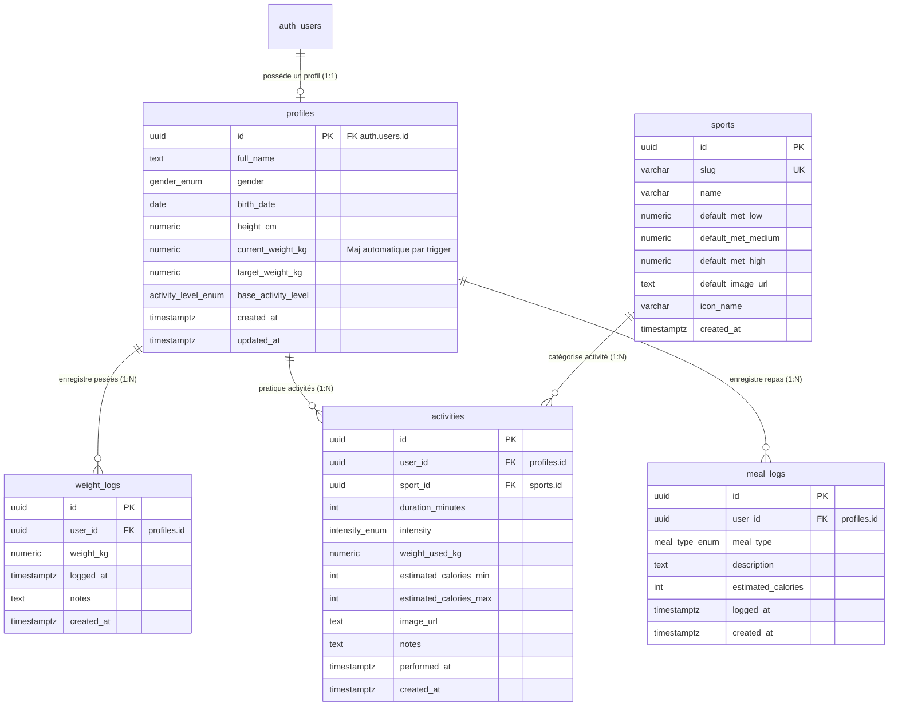

# Schéma Relationnel, Sécurité RLS & Triggers SQL — Metrik

> **SGBD :** PostgreSQL 15+ (Supabase)  
> **Extension requise :** `pgcrypto` (pour `gen_random_uuid()`)  
> **Statut :** Production-ready / Prêt à exécuter dans l'éditeur SQL de Supabase  

Ce document fournit le script SQL complet et exécutable en une seule fois, comprenant les types personnalisés, les tables, les contraintes, les triggers automatiques, les politiques de sécurité RLS (Row Level Security), la configuration du bucket Supabase Storage et les données de référence (seeds).

---

## 1. Schéma Relationnel (Diagramme Entité-Relation)



---

## 2. Script SQL Complet & Prêt à Exécuter

Copiez et collez le script ci-dessous dans l'onglet **SQL Editor** de votre tableau de bord Supabase :

```sql
-- =============================================================================
-- METRIK DATABASE INITIALIZATION SCRIPT
-- =============================================================================

-- 1. ACTIVATION DES EXTENSIONS
CREATE EXTENSION IF NOT EXISTS "pgcrypto";

-- 2. DÉFINITION DES TYPES ÉNUMÉRÉS (ENUMS)
DO $$ BEGIN
    CREATE TYPE gender_enum AS ENUM ('male', 'female', 'other');
EXCEPTION
    WHEN duplicate_object THEN null;
END $$;

DO $$ BEGIN
    CREATE TYPE activity_level_enum AS ENUM (
        'sedentary',        -- Sédentaire (PAL 1.2)
        'lightly_active',   -- Légèrement actif (PAL 1.375)
        'moderately_active',-- Modérément actif (PAL 1.55)
        'very_active'       -- Très actif (PAL 1.725)
    );
EXCEPTION
    WHEN duplicate_object THEN null;
END $$;

DO $$ BEGIN
    CREATE TYPE intensity_enum AS ENUM ('low', 'medium', 'high');
EXCEPTION
    WHEN duplicate_object THEN null;
END $$;

DO $$ BEGIN
    CREATE TYPE meal_type_enum AS ENUM ('breakfast', 'lunch', 'dinner', 'snack');
EXCEPTION
    WHEN duplicate_object THEN null;
END $$;


-- =============================================================================
-- 3. CRÉATION DES TABLES
-- =============================================================================

-- 3.1 Table Profiles (Extension de auth.users)
CREATE TABLE IF NOT EXISTS public.profiles (
    id UUID PRIMARY KEY REFERENCES auth.users(id) ON DELETE CASCADE,
    full_name TEXT,
    gender gender_enum DEFAULT 'male',
    birth_date DATE,
    height_cm NUMERIC(5, 2) CHECK (height_cm > 50 AND height_cm < 280),
    current_weight_kg NUMERIC(5, 2) CHECK (current_weight_kg > 20 AND current_weight_kg < 400),
    target_weight_kg NUMERIC(5, 2) CHECK (target_weight_kg > 20 AND target_weight_kg < 400),
    base_activity_level activity_level_enum DEFAULT 'sedentary',
    created_at TIMESTAMPTZ NOT NULL DEFAULT timezone('utc'::text, now()),
    updated_at TIMESTAMPTZ NOT NULL DEFAULT timezone('utc'::text, now())
);

-- 3.2 Table Weight Logs (Journal des pesées)
CREATE TABLE IF NOT EXISTS public.weight_logs (
    id UUID PRIMARY KEY DEFAULT gen_random_uuid(),
    user_id UUID NOT NULL REFERENCES public.profiles(id) ON DELETE CASCADE,
    weight_kg NUMERIC(5, 2) NOT NULL CHECK (weight_kg > 20 AND weight_kg < 400),
    logged_at TIMESTAMPTZ NOT NULL DEFAULT timezone('utc'::text, now()),
    notes TEXT,
    created_at TIMESTAMPTZ NOT NULL DEFAULT timezone('utc'::text, now())
);

-- 3.3 Table Sports (Référentiel des sports et indices METs)
CREATE TABLE IF NOT EXISTS public.sports (
    id UUID PRIMARY KEY DEFAULT gen_random_uuid(),
    slug VARCHAR(50) UNIQUE NOT NULL,
    name VARCHAR(100) NOT NULL,
    default_met_low NUMERIC(4, 2) NOT NULL CHECK (default_met_low > 0),
    default_met_medium NUMERIC(4, 2) NOT NULL CHECK (default_met_medium >= default_met_low),
    default_met_high NUMERIC(4, 2) NOT NULL CHECK (default_met_high >= default_met_medium),
    default_image_url TEXT,
    icon_name VARCHAR(50),
    created_at TIMESTAMPTZ NOT NULL DEFAULT timezone('utc'::text, now())
);

-- 3.4 Table Activities (Journal des séances de sport)
CREATE TABLE IF NOT EXISTS public.activities (
    id UUID PRIMARY KEY DEFAULT gen_random_uuid(),
    user_id UUID NOT NULL REFERENCES public.profiles(id) ON DELETE CASCADE,
    sport_id UUID NOT NULL REFERENCES public.sports(id) ON DELETE RESTRICT,
    duration_minutes INTEGER NOT NULL CHECK (duration_minutes > 0 AND duration_minutes <= 1440),
    intensity intensity_enum NOT NULL DEFAULT 'medium',
    weight_used_kg NUMERIC(5, 2) NOT NULL CHECK (weight_used_kg > 20 AND weight_used_kg < 400),
    estimated_calories_min INTEGER NOT NULL CHECK (estimated_calories_min >= 0),
    estimated_calories_max INTEGER NOT NULL CHECK (estimated_calories_max >= estimated_calories_min),
    image_url TEXT,
    notes TEXT,
    performed_at TIMESTAMPTZ NOT NULL DEFAULT timezone('utc'::text, now()),
    created_at TIMESTAMPTZ NOT NULL DEFAULT timezone('utc'::text, now())
);

-- 3.5 Table Meal Logs (Journal simplifié de nutrition)
CREATE TABLE IF NOT EXISTS public.meal_logs (
    id UUID PRIMARY KEY DEFAULT gen_random_uuid(),
    user_id UUID NOT NULL REFERENCES public.profiles(id) ON DELETE CASCADE,
    meal_type meal_type_enum NOT NULL,
    description TEXT NOT NULL,
    estimated_calories INTEGER NOT NULL CHECK (estimated_calories >= 0 AND estimated_calories <= 10000),
    logged_at TIMESTAMPTZ NOT NULL DEFAULT timezone('utc'::text, now()),
    created_at TIMESTAMPTZ NOT NULL DEFAULT timezone('utc'::text, now())
);


-- =============================================================================
-- 4. INDEX DE PERFORMANCE
-- =============================================================================

CREATE INDEX IF NOT EXISTS idx_weight_logs_user_logged_at 
    ON public.weight_logs(user_id, logged_at DESC);

CREATE INDEX IF NOT EXISTS idx_activities_user_performed_at 
    ON public.activities(user_id, performed_at DESC);

CREATE INDEX IF NOT EXISTS idx_activities_sport_id 
    ON public.activities(sport_id);

CREATE INDEX IF NOT EXISTS idx_meal_logs_user_logged_at 
    ON public.meal_logs(user_id, logged_at DESC);


-- =============================================================================
-- 5. FONCTIONS ET TRIGGERS AUTOMATIQUES
-- =============================================================================

-- 5.1 Trigger de mise à jour automatique de la colonne updated_at
CREATE OR REPLACE FUNCTION public.handle_updated_at()
RETURNS TRIGGER AS $$
BEGIN
    NEW.updated_at = timezone('utc'::text, now());
    RETURN NEW;
END;
$$ LANGUAGE plpgsql;

DROP TRIGGER IF EXISTS set_profiles_updated_at ON public.profiles;
CREATE TRIGGER set_profiles_updated_at
    BEFORE UPDATE ON public.profiles
    FOR EACH ROW
    EXECUTE FUNCTION public.handle_updated_at();

-- 5.2 Trigger d'initialisation automatique du profil lors du sign-up auth.users
CREATE OR REPLACE FUNCTION public.handle_new_user()
RETURNS TRIGGER AS $$
BEGIN
    INSERT INTO public.profiles (id, full_name)
    VALUES (
        NEW.id,
        COALESCE(NEW.raw_user_meta_data->>'full_name', NEW.raw_user_meta_data->>'name', '')
    )
    ON CONFLICT (id) DO NOTHING;
    RETURN NEW;
END;
$$ LANGUAGE plpgsql SECURITY DEFINER;

DROP TRIGGER IF EXISTS on_auth_user_created ON auth.users;
CREATE TRIGGER on_auth_user_created
    AFTER INSERT ON auth.users
    FOR EACH ROW
    EXECUTE FUNCTION public.handle_new_user();

-- 5.3 Trigger de synchronisation automatique du poids actuel dans profiles
-- Ce trigger trouve la pesée la plus récente chronologiquement pour l'utilisateur
CREATE OR REPLACE FUNCTION public.sync_profile_current_weight()
RETURNS TRIGGER AS $$
DECLARE
    target_user_id UUID;
    latest_weight NUMERIC(5, 2);
BEGIN
    -- Détermine l'user_id selon l'opération (INSERT/UPDATE vs DELETE)
    IF TG_OP = 'DELETE' THEN
        target_user_id := OLD.user_id;
    ELSE
        target_user_id := NEW.user_id;
    END IF;

    -- Sélectionne la valeur de la pesée la plus récente
    SELECT weight_kg INTO latest_weight
    FROM public.weight_logs
    WHERE user_id = target_user_id
    ORDER BY logged_at DESC, created_at DESC
    LIMIT 1;

    -- Met à jour le profil avec la dernière valeur (ou NULL si aucune pesée restante)
    UPDATE public.profiles
    SET current_weight_kg = latest_weight,
        updated_at = timezone('utc'::text, now())
    WHERE id = target_user_id;

    RETURN NULL;
END;
$$ LANGUAGE plpgsql SECURITY DEFINER;

DROP TRIGGER IF EXISTS on_weight_log_changed ON public.weight_logs;
CREATE TRIGGER on_weight_log_changed
    AFTER INSERT OR UPDATE OR DELETE ON public.weight_logs
    FOR EACH ROW
    EXECUTE FUNCTION public.sync_profile_current_weight();


-- =============================================================================
-- 6. ROW LEVEL SECURITY (RLS) — SÉCURITÉ ABSOLUE
-- =============================================================================

-- Activation de RLS sur toutes les tables applicatives
ALTER TABLE public.profiles ENABLE ROW LEVEL SECURITY;
ALTER TABLE public.weight_logs ENABLE ROW LEVEL SECURITY;
ALTER TABLE public.sports ENABLE ROW LEVEL SECURITY;
ALTER TABLE public.activities ENABLE ROW LEVEL SECURITY;
ALTER TABLE public.meal_logs ENABLE ROW LEVEL SECURITY;

-- 6.1 Politiques pour PROFILES
CREATE POLICY "Users can view own profile" 
    ON public.profiles FOR SELECT 
    USING (auth.uid() = id);

CREATE POLICY "Users can update own profile" 
    ON public.profiles FOR UPDATE 
    USING (auth.uid() = id);

CREATE POLICY "Users can insert own profile" 
    ON public.profiles FOR INSERT 
    WITH CHECK (auth.uid() = id);

-- 6.2 Politiques pour WEIGHT_LOGS
CREATE POLICY "Users can view own weight logs" 
    ON public.weight_logs FOR SELECT 
    USING (auth.uid() = user_id);

CREATE POLICY "Users can insert own weight logs" 
    ON public.weight_logs FOR INSERT 
    WITH CHECK (auth.uid() = user_id);

CREATE POLICY "Users can update own weight logs" 
    ON public.weight_logs FOR UPDATE 
    USING (auth.uid() = user_id);

CREATE POLICY "Users can delete own weight logs" 
    ON public.weight_logs FOR DELETE 
    USING (auth.uid() = user_id);

-- 6.3 Politiques pour SPORTS (Référentiel public / lecture partagée)
CREATE POLICY "Authenticated users can read sports catalog" 
    ON public.sports FOR SELECT 
    TO authenticated 
    USING (true);

-- 6.4 Politiques pour ACTIVITIES
CREATE POLICY "Users can view own activities" 
    ON public.activities FOR SELECT 
    USING (auth.uid() = user_id);

CREATE POLICY "Users can insert own activities" 
    ON public.activities FOR INSERT 
    WITH CHECK (auth.uid() = user_id);

CREATE POLICY "Users can update own activities" 
    ON public.activities FOR UPDATE 
    USING (auth.uid() = user_id);

CREATE POLICY "Users can delete own activities" 
    ON public.activities FOR DELETE 
    USING (auth.uid() = user_id);

-- 6.5 Politiques pour MEAL_LOGS
CREATE POLICY "Users can view own meal logs" 
    ON public.meal_logs FOR SELECT 
    USING (auth.uid() = user_id);

CREATE POLICY "Users can insert own meal logs" 
    ON public.meal_logs FOR INSERT 
    WITH CHECK (auth.uid() = user_id);

CREATE POLICY "Users can update own meal logs" 
    ON public.meal_logs FOR UPDATE 
    USING (auth.uid() = user_id);

CREATE POLICY "Users can delete own meal logs" 
    ON public.meal_logs FOR DELETE 
    USING (auth.uid() = user_id);


-- =============================================================================
-- 7. CONFIGURATION DU BUCKET STORAGE (activity-images)
-- =============================================================================

-- Création du bucket si non existant (public pour affichage facile CDN)
INSERT INTO storage.buckets (id, name, public, file_size_limit, allowed_mime_types)
VALUES (
    'activity-images',
    'activity-images',
    true,
    5242880, -- 5 MB max
    ARRAY['image/jpeg', 'image/png', 'image/webp', 'image/heic']
)
ON CONFLICT (id) DO UPDATE SET
    public = true,
    file_size_limit = 5242880,
    allowed_mime_types = ARRAY['image/jpeg', 'image/png', 'image/webp', 'image/heic'];

-- Politiques RLS pour le bucket storage.objects
CREATE POLICY "Users can upload their own activity images"
    ON storage.objects FOR INSERT
    TO authenticated
    WITH CHECK (
        bucket_id = 'activity-images' AND
        (storage.foldername(name))[1] = auth.uid()::text
    );

CREATE POLICY "Users can update their own activity images"
    ON storage.objects FOR UPDATE
    TO authenticated
    USING (
        bucket_id = 'activity-images' AND
        (storage.foldername(name))[1] = auth.uid()::text
    );

CREATE POLICY "Users can delete their own activity images"
    ON storage.objects FOR DELETE
    TO authenticated
    USING (
        bucket_id = 'activity-images' AND
        (storage.foldername(name))[1] = auth.uid()::text
    );

CREATE POLICY "Public read access for activity images"
    ON storage.objects FOR SELECT
    USING (bucket_id = 'activity-images');


-- =============================================================================
-- 8. SEEDS : RÉFÉRENTIEL DES SPORTS & VALEURS METs
-- =============================================================================

INSERT INTO public.sports (slug, name, default_met_low, default_met_medium, default_met_high, default_image_url, icon_name)
VALUES
    ('padel', 'Padel', 5.50, 7.00, 8.50, '/images/sports/padel.webp', 'Trophy'),
    ('tennis', 'Tennis', 5.00, 7.30, 8.80, '/images/sports/tennis.webp', 'CircleDot'),
    ('football', 'Football', 6.50, 8.00, 10.00, '/images/sports/football.webp', 'Activity'),
    ('five', 'Football en salle (Five)', 7.50, 9.00, 11.00, '/images/sports/five.webp', 'Flame'),
    ('running', 'Course à pied', 7.00, 9.80, 12.50, '/images/sports/running.webp', 'Footprints'),
    ('basketball', 'Basketball', 6.00, 8.00, 10.00, '/images/sports/basketball.webp', 'Dribbble'),
    ('swimming', 'Natation', 5.50, 7.50, 10.00, '/images/sports/swimming.webp', 'Waves')
ON CONFLICT (slug) DO UPDATE SET
    name = EXCLUDED.name,
    default_met_low = EXCLUDED.default_met_low,
    default_met_medium = EXCLUDED.default_met_medium,
    default_met_high = EXCLUDED.default_met_high,
    default_image_url = EXCLUDED.default_image_url,
    icon_name = EXCLUDED.icon_name;
```

---

## 3. Définitions TypeScript Dérivées (`types/database.types.ts`)

Pour garantir un typage 100% strict et l'autocomplétion complète de TypeScript avec les clients `@supabase/ssr`, ce schéma correspond à la structure suivante :

```typescript
export type Json =
  | string
  | number
  | boolean
  | null
  | { [key: string]: Json | undefined }
  | Json[];

export type Gender = 'male' | 'female' | 'other';
export type ActivityLevel = 'sedentary' | 'lightly_active' | 'moderately_active' | 'very_active';
export type Intensity = 'low' | 'medium' | 'high';
export type MealType = 'breakfast' | 'lunch' | 'dinner' | 'snack';

export interface Database {
  public: {
    Tables: {
      profiles: {
        Row: {
          id: string;
          full_name: string | null;
          gender: Gender;
          birth_date: string | null;
          height_cm: number | null;
          current_weight_kg: number | null;
          target_weight_kg: number | null;
          base_activity_level: ActivityLevel;
          created_at: string;
          updated_at: string;
        };
        Insert: {
          id: string;
          full_name?: string | null;
          gender?: Gender;
          birth_date?: string | null;
          height_cm?: number | null;
          current_weight_kg?: number | null;
          target_weight_kg?: number | null;
          base_activity_level?: ActivityLevel;
          created_at?: string;
          updated_at?: string;
        };
        Update: {
          id?: string;
          full_name?: string | null;
          gender?: Gender;
          birth_date?: string | null;
          height_cm?: number | null;
          current_weight_kg?: number | null;
          target_weight_kg?: number | null;
          base_activity_level?: ActivityLevel;
          updated_at?: string;
        };
      };
      weight_logs: {
        Row: {
          id: string;
          user_id: string;
          weight_kg: number;
          logged_at: string;
          notes: string | null;
          created_at: string;
        };
        Insert: {
          id?: string;
          user_id: string;
          weight_kg: number;
          logged_at?: string;
          notes?: string | null;
          created_at?: string;
        };
        Update: {
          weight_kg?: number;
          logged_at?: string;
          notes?: string | null;
        };
      };
      sports: {
        Row: {
          id: string;
          slug: string;
          name: string;
          default_met_low: number;
          default_met_medium: number;
          default_met_high: number;
          default_image_url: string | null;
          icon_name: string | null;
          created_at: string;
        };
        Insert: {
          id?: string;
          slug: string;
          name: string;
          default_met_low: number;
          default_met_medium: number;
          default_met_high: number;
          default_image_url?: string | null;
          icon_name?: string | null;
        };
        Update: {
          slug?: string;
          name?: string;
          default_met_low?: number;
          default_met_medium?: number;
          default_met_high?: number;
          default_image_url?: string | null;
          icon_name?: string | null;
        };
      };
      activities: {
        Row: {
          id: string;
          user_id: string;
          sport_id: string;
          duration_minutes: number;
          intensity: Intensity;
          weight_used_kg: number;
          estimated_calories_min: number;
          estimated_calories_max: number;
          image_url: string | null;
          notes: string | null;
          performed_at: string;
          created_at: string;
        };
        Insert: {
          id?: string;
          user_id: string;
          sport_id: string;
          duration_minutes: number;
          intensity?: Intensity;
          weight_used_kg: number;
          estimated_calories_min: number;
          estimated_calories_max: number;
          image_url?: string | null;
          notes?: string | null;
          performed_at?: string;
          created_at?: string;
        };
        Update: {
          sport_id?: string;
          duration_minutes?: number;
          intensity?: Intensity;
          weight_used_kg?: number;
          estimated_calories_min?: number;
          estimated_calories_max?: number;
          image_url?: string | null;
          notes?: string | null;
          performed_at?: string;
        };
      };
      meal_logs: {
        Row: {
          id: string;
          user_id: string;
          meal_type: MealType;
          description: string;
          estimated_calories: number;
          logged_at: string;
          created_at: string;
        };
        Insert: {
          id?: string;
          user_id: string;
          meal_type: MealType;
          description: string;
          estimated_calories: number;
          logged_at?: string;
          created_at?: string;
        };
        Update: {
          meal_type?: MealType;
          description?: string;
          estimated_calories?: number;
          logged_at?: string;
        };
      };
    };
  };
}
```
