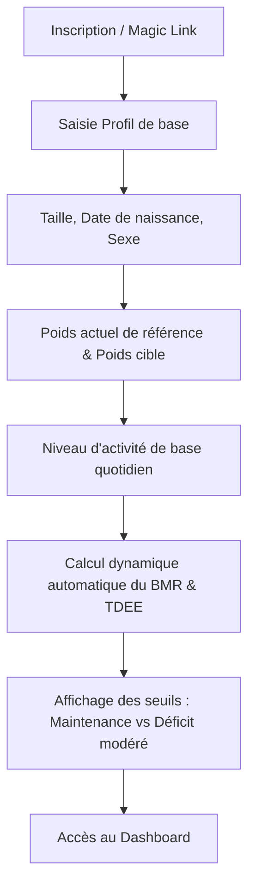
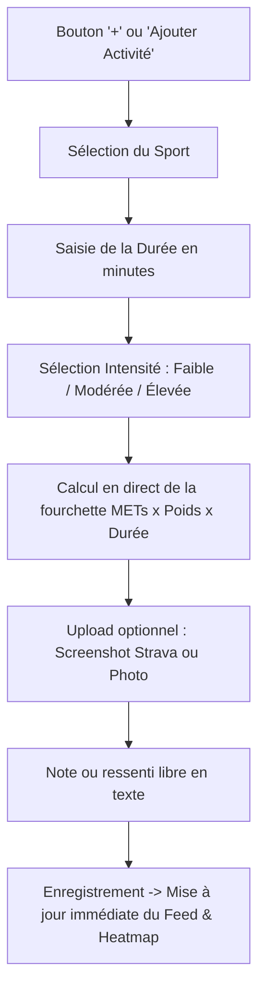
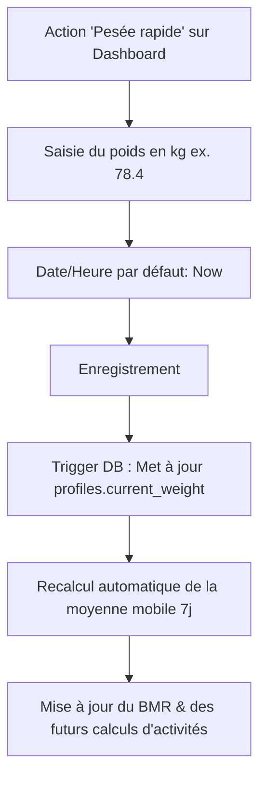
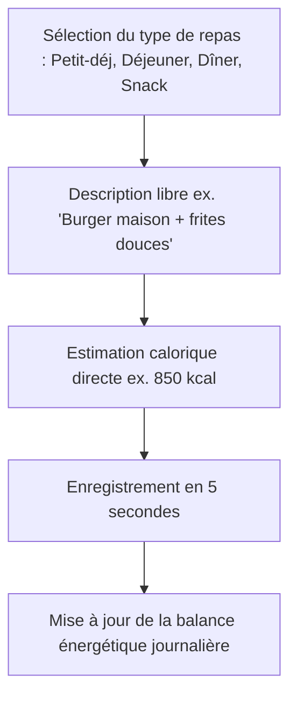

# Product Requirements Document (PRD) — Metrik

> **Version :** 1.0.0  
> **Statut :** Validé / Prêt pour implémentation  
> **Auteur :** Tech Lead & Product Architect  
> **Dernière mise à jour :** 2026-09-18  

---

## 1. Vision Produit & Proposition de Valeur

### 1.1 Le Problème
Les applications de fitness et de nutrition grand public actuelles (MyFitnessPal, Strava, Yazio, Lose It!, etc.) souffrent de dérives majeures qui gâchent l'expérience utilisateur :
- **Modèles freemium agressifs :** Des fonctionnalités primaires (analyses de tendances, graphiques à plus de 7 jours, export de données) sont masquées derrière des abonnements exorbitants (80€ à 120€/an) et des paywalls omniprésents.
- **Comptage calorique obsessionnel et anxiogène :** Obligation de peser chaque aliment au gramme près, de scanner chaque code-barres et d'enregistrer des listes infinies d'ingrédients, ce qui mène au découragement en moins de 3 semaines ou favorise des troubles du comportement alimentaire.
- **Dépenses sportives fantaisistes :** La plupart des montres et applications affichent un chiffre précis au calorie près (ex. `634 kcal`), donnant une fausse illusion de précision biométrique alors que la marge d'erreur réelle des capteurs optiques oscille entre 15% et 30%.
- **Interfaces encombrées :** Publicités intrusives, flux sociaux toxiques non désirés, et gamification infantilisante (flammes, badges inutiles).

### 1.2 La Solution : Metrik
**Metrik** est une application web personnelle (PWA-ready) ultra-rapide, sobre et élégante, conçue pour réconcilier l'utilisateur avec son suivi de santé :
1. **Zéro friction :** Un log de repas prend 5 secondes (une photo ou un texte court et une estimation de calories à la louche).
2. **Honest Ranges (Fourchettes honnêtes) :** Aucune fausse promesse sur la dépense sportive ; les calories sont calculées dynamiquement selon la science métabolique (METs) et indexées sur le poids du jour, sous forme de fourchette réaliste ($\pm 10\%$).
3. **Visuel SaaS moderne :** Un journal d'activités façon plateforme haut de gamme (Airbnb / immo de standing), valorisant les captures d'écran Strava ou les photos d'effort.
4. **Data-viz utile et gratifiante :** Courbe de poids avec lissage par moyenne mobile 7 jours et Heatmap de consistance façon GitHub pour ancrer la régularité sportive plutôt que la punition calorique.

---

## 2. Personas & Principes de Conception

### 2.1 User Persona Principal
- **Nom :** Alex, 29 ans, cadre actif et sportif amateur (Padel 2x/semaine, Foot à 5 le jeudi, Course occasionnelle).
- **Objectif :** Suivre sa composition corporelle, maintenir une discipline sportive régulière sans tomber dans l'obsession de peser son riz ou d'enregistrer chaque goutte d'huile d'olive.
- **Frustration passée :** A désinstallé MyFitnessPal au bout de 10 jours car scanner 15 aliments par jour prenait 25 minutes quotidiennes. A désactivé les notifications Strava envahies de défis sponsorisés.

### 2.2 Principes de Conception (Product Principles)
- **Simplicité radicale :** Pas plus de 3 clics ou 10 secondes pour enregistrer un événement (poids, sport, repas).
- **Vérité scientifique vs pseudo-précision :** Préférer une fourchette honnête (`650–790 kcal`) à un chiffre trompeur (`714 kcal`).
- **Esthétique premium :** Interface minimaliste, typographie ciselée, micro-interactions soignées, Dark/Light mode natif.
- **Propriété des données :** L'utilisateur est maître absolu de ses métriques. Zéro publicité, zéro revente de données.

---

## 3. User Flows Détaillés

### 3.1 Flow 1 : Onboarding & Configuration Métabolique

### 3.2 Flow 2 : Journalisation d'une Activité Sportive

### 3.3 Flow 3 : Saisie d'une Pesée

### 3.4 Flow 4 : Suivi Alimentaire Décomplexé

---

## 4. Spécifications Fonctionnelles par Module

### 4.1 Module Authentification & Profil
- **Mécanisme :** Supabase Auth supportant l'authentification par email/mot de passe et Magic Link sans mot de passe.
- **Données profil :**
  - Nom complet / Pseudonyme.
  - Sexe biologique (pour le calcul du BMR : Homme / Femme).
  - Date de naissance (dérivation de l'âge dynamique).
  - Taille (en cm).
  - Poids actuel de référence (kg) — synchronisé avec la dernière pesée.
  - Poids cible (kg, optionnel).
  - Niveau d'activité quotidienne hors sport (Physical Activity Level - PAL) :
    - *Sédentaire (bureau, peu de marche) :* $1.2$
    - *Légèrement actif (1 à 3 km de marche quotidienne) :* $1.375$
    - *Modérément actif (travail debout, déplacements réguliers) :* $1.55$
    - *Très actif (travail physique intense) :* $1.725$

### 4.2 Module Calculs Physiologiques & Métaboliques

#### 4.2.1 Formule BMR (Basal Metabolic Rate) — Mifflin-St Jeor
Reconnue comme la formule prédictive la plus fiable cliniquement pour les individus non hospitalisés :
$$\text{BMR}_{\text{Homme}} = (10 \times \text{poids in kg}) + (6.25 \times \text{taille in cm}) - (5 \times \text{âge}) + 5$$
$$\text{BMR}_{\text{Femme}} = (10 \times \text{poids in kg}) + (6.25 \times \text{taille in cm}) - (5 \times \text{âge}) - 161$$

#### 4.2.2 Dépense de base quotidienne (TDEE hors sport)
$$\text{TDEE}_{\text{base}} = \text{BMR} \times \text{PAL}$$

#### 4.2.3 Cibles caloriques affichées
1. **Maintenance :** $\text{Calories} = \text{TDEE}_{\text{base}} + \text{Dépense sportive du jour}$
2. **Déficit Modéré (Recommandé - perte saine de 300 à 500g/semaine) :**  
   $\text{Cible} = \text{Maintenance} - 400\text{ kcal}$ (garantissant de ne jamais descendre sous le BMR physiologique).

---

### 4.3 Module Activités Sportives & Moteur METs

#### 4.3.1 Référentiel des Sports & Indices METs (Metabolic Equivalent of Task)
Le MET représente le ratio de dépense énergétique par rapport au repos ($1\text{ MET} \approx 1\text{ kcal/kg/heure}$).  
Tableau des valeurs pré-configurées dans Metrik :

| Sport | Slug | MET Faible | MET Moyen | MET Élevé | Illustration par défaut |
| :--- | :--- | :---: | :---: | :---: | :--- |
| **Padel** | `padel` | 5.5 (Loisir / Double calme) | 7.0 (Match régulier) | 8.5 (Match compétitif intense) | `/images/sports/padel.webp` |
| **Tennis** | `tennis` | 5.0 (Échange loisir) | 7.3 (Simple modéré) | 8.8 (Simple compétition) | `/images/sports/tennis.webp` |
| **Football** | `football` | 6.5 (Entraînement léger) | 8.0 (Match 11 vs 11) | 10.0 (Match haute intensité) | `/images/sports/football.webp` |
| **Foot en salle (Five)** | `five` | 7.5 (Rythme continu) | 9.0 (Match intense avec remplacements) | 11.0 (Cardio maximal) | `/images/sports/five.webp` |
| **Course à pied** | `running` | 7.0 (~8.5 km/h) | 9.8 (~10.5 km/h) | 12.5 (>12.5 km/h) | `/images/sports/running.webp` |
| **Basketball** | `basketball` | 6.0 (Tirs / Demi-terrain) | 8.0 (Match complet loisir) | 10.0 (Match officiel) | `/images/sports/basketball.webp` |
| **Natation** | `swimming` | 5.5 (Brasse modérée) | 7.5 (Crawl régulier) | 10.0 (Crawl rapide / fractionné) | `/images/sports/swimming.webp` |

#### 4.3.2 Règle de calcul de la fourchette calorique
Soit $M$ la valeur MET choisie selon l'intensité, $P$ le dernier poids connu en kg, et $D_h$ la durée en heures ($D_m / 60$) :
$$\text{Calories}_{\text{médiane}} = M \times P \times D_h$$
$$\text{Fourchette Min} = \text{Round}(\text{Calories}_{\text{médiane}} \times 0.90)$$
$$\text{Fourchette Max} = \text{Round}(\text{Calories}_{\text{médiane}} \times 1.10)$$

*Exemple pratique :* Alex pèse 78 kg, joue 90 minutes (1.5 h) au Padel à intensité moyenne (MET 7.0).  
$\text{Calories}_{\text{médiane}} = 7.0 \times 78 \times 1.5 = 819\text{ kcal}$.  
**Fourchette affichée :** `737 – 901 kcal`.

#### 4.3.3 UI du Journal d'Activités (Feed style Immobilier / Airbnb)
- **Disposition :** Cards horizontales, bords arrondis (`rounded-2xl`), légères bordures élégantes, fond adaptatif dark/light.
- **Section Gauche (Desktop ~35% largeur) :**
  - Image au format 16:10 ou 4:3 avec `object-cover`.
  - Si l'utilisateur a uploadé un screenshot Strava ou une photo de terrain : affichage de la photo avec modal zoom (lightbox).
  - Si aucune photo n'est uploadée : visuel vectoriel ou photo soignée par défaut du sport.
- **Section Droite (Desktop ~65% largeur) :**
  - Header : Titre du sport + badge pill pour l'intensité (Faible = Vert pastel, Modéré = Bleu électrique, Élevé = Ambre/Corail).
  - Ligne de métriques : Horodatage (ex. `Aujourd'hui à 18h30` ou `Samedi 14 Sept.`), Durée (ex. `1h 30m`), et Badge proéminent de la fourchette calorique (ex. `🔥 737 – 901 kcal`).
  - Corps : Note textuelle libre (ex. *« Super sensations sur le revers vitré, victoire 6/4 7/5 »*).
  - Actions : Menu contextuel discret (Modifier, Supprimer).

---

### 4.4 Module Suivi du Poids & Évolution

#### 4.4.1 Log de Poids
- Champ numérique direct avec pas de 0.1 kg (ex. `78.3`).
- Horodatage personnalisable (par défaut `now()`).
- Commentaire optionnel (ex. *« Pesée post-repas de famille »*, *« Au réveil à jeun »*).
- **Consistance de base de données :** L'enregistrement d'une pesée met à jour en temps réel la colonne `current_weight_kg` du profil utilisateur via un trigger SQL.

#### 4.4.2 Courbe de Poids Interactive & Lissage
- **Composant Recharts :**
  - **Points réels :** Scatter ou ligne fine discrète reliant les pesées réelles.
  - **Ligne de tendance lissée :** Courbe spline en bleu électrique (`#2563EB`) représentant la **moyenne mobile sur 7 jours**.
- **Filtres de granularité :**
  - `7 Jours` : Zoom sur la semaine en cours.
  - `30 Jours` : Vue mensuelle standard.
  - `3 Mois` : Visualisation du cycle moyen.
  - `Tout` : Historique complet depuis l'inscription.
- **Indicateur de delta :** Variation sur 7 jours ($\Delta_{7d}$) et variation par rapport au poids de départ ($\Delta_{\text{total}}$).

---

### 4.5 Module Suivi Alimentaire Décomplexé

#### 4.5.1 Philosophie
- Éradiquer le syndrome du comptage obsessionnel.
- L'utilisateur catégorise simplement son repas :
  - **Petit-déjeuner**
  - **Déjeuner**
  - **Dîner**
  - **Snack / Collation**
- Saisie du nom ou résumé du repas : *« 2 œufs au plat, pain de seigle, café, avocat »*.
- Estimation de l'apport énergétique global (saisie directe en kcal, ex. `550`).
- **Évolution Phase 5 :** Recherche auto-complétée optionnelle via Open Food Facts pour les produits packagés ou les repas types, sans obliger à renseigner les micro-nutriments (lipides/glucides/protéines) sauf si désiré.

---

### 4.6 Module Dashboard & Data-Visualisation

#### 4.6.1 Cartes KPI du Haut
1. **Dernier Poids :** Valeur en grand (ex. `77.8 kg`), badge de variation sur 7 jours (ex. `-0.4 kg` en vert).
2. **Dépense Sportive Hebdo :** Total estimé de la semaine (ex. `2 850 – 3 200 kcal`) sur $X$ sessions.
3. **Consistance du Mois :** Nombre de jours actifs / 30 jours (ex. `14 / 30 jours (47%)`).
4. **Balance Énergétique du Jour :** Jauge de progression confrontant le TDEE du jour + sports vs calories ingérées.

#### 4.6.2 Heatmap d'Activité façon GitHub
- Grille horizontale de 52 semaines (ou 16 semaines sur mobile) découpée par jour (Lundi -> Dimanche).
- 4 niveaux d'intensité selon la durée ou la dépense sportive du jour :
  - Niveau 0 : Aucun sport (Gris neutre en Light mode / Gris sombre en Dark mode).
  - Niveau 1 : Effort léger (< 30 min ou < 300 kcal) -> Bleu ciel très pâle.
  - Niveau 2 : Effort modéré (30-60 min ou 300-650 kcal) -> Bleu intermédiaire.
  - Niveau 3 : Effort soutenu (> 60 min ou > 650 kcal) -> Bleu électrique vibrant (`#2563EB`).
- Tooltip au survol : Date, sport(s) pratiqué(s), durée cumulée, fourchette de calories.

#### 4.6.3 Graphique Barres Hebdomadaire (Dépenses vs Apports)
- Bar chart groupé ou empilé sur les 7 derniers jours :
  - Barre 1 : Calories ingérées (Repas).
  - Barre 2 : Dépense totale estimée ($\text{TDEE}_{\text{base}} + \text{Sport}$).
  - Ligne de référence : TDEE de maintenance.

---

## 5. Exigences Non-Fonctionnelles & UX

| Critère | Exigence |
| :--- | :--- |
| **Performance** | Temps de premier chargement (FCP) < 1.0s sur connexion 4G. Time to Interactive (TTI) < 1.5s. |
| **Compatibilité** | 100% Responsive de 360px (mobile) à 2560px (écrans ultra-larges). Mode tactile optimisé (targets min 44x44px). |
| **Thématisation** | Dark mode & Light mode sans scintillement (`next-themes`, classe `.dark`, variables CSS Tailwind). |
| **Offline / PWA** | Installation possible sur l'écran d'accueil iOS/Android via Web App Manifest. Cache des assets statiques. |
| **Sécurité** | Zéro fuite de données entre utilisateurs : isolation stricte au niveau de la base de données via PostgreSQL Row Level Security (RLS). |
| **Disponibilité** | Architecture Serverless hébergée sur Vercel avec persistance Supabase Cloud. |

---

## 6. Métriques de Succès Produit (KPIs)
- **Taux de rétention à J+30 :** > 60% (vs moyenne de l'industrie fitness ~15%).
- **Temps moyen de saisie d'un log :** < 15 secondes pour une activité sportive avec photo, < 8 secondes pour un repas.
- **Fréquence d'utilisation hebdomadaire :** Minimum 4 sessions de log par semaine par utilisateur actif.
- **Satisfaction UX :** Taux d'abandon de saisie < 3% sur le modal d'activité.
