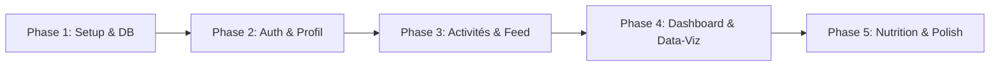

# Metrik — Suivi Fitness, Poids & Nutrition Décomplexé

<div align="center">


**L'application web personnelle de tracking de santé pensée pour éliminer la frustration des modèles freemium.**  
*Zéro publicité • Zéro paywall • Calculs caloriques honnêtes par fourchettes • Zéro pesée d'aliments au gramme.*

[-black?style=flat-square&logo=next.js)](https://nextjs.org/)
[](https://react.dev/)
[](https://www.typescriptlang.org/)
[](https://tailwindcss.com/)
[](https://supabase.com/)
[](LICENSE)

</div>

---

## 📖 Sommaire
1. [À Propos de Metrik](#-à-propos-de-metrik)
2. [Stack Technique](#-stack-technique)
3. [Architecture de la Documentation](#-architecture-de-la-documentation)
4. [Prérequis & Installation](#-prérequis--installation)
5. [Variables d'Environnement](#-variables-denvironnement)
6. [Mise en Place de la Base de Données](#-mise-en-place-de-la-base-de-données)
7. [Conventions de Développement](#-conventions-de-développement)
8. [Roadmap d'Implémentation](#-roadmap-dimplémentation)

---

## 🌟 À Propos de Metrik

La majorité des applications fitness grand public (MyFitnessPal, Strava, Yazio) ont dérivé vers des modèles agressifs : abonnement mensuel pour voir un graphique à 30 jours, saisie anxiogène et chronophage de chaque gramme de nourriture, et dépenses caloriques illusoires au calorie près.

**Metrik prend le contre-pied total avec 4 piliers fondamentaux :**
- **Fourchettes caloriques honnêtes :** Estimation scientifique basée sur les indices **METs (Metabolic Equivalent of Task)** indexés dynamiquement sur votre poids du jour, avec une marge réaliste de $\pm 10\%$.
- **Feed d'activités façon Airbnb / Plateforme de standing :** Présentation élégante sous forme de cards horizontales mettant en avant vos captures d'écran Strava ou photos d'effort.
- **Suivi alimentaire décomplexé :** Un log de repas se fait en 5 secondes. Pas de scan de code-barres obligatoire ni de pesée millimétrée : vous indiquez une estimation globale et une description libre.
- **Data-visualisation gratifiante :** Courbe de poids lissée sur moyenne mobile 7 jours et calendrier de consistance sous forme de **Heatmap style GitHub** pour valoriser la régularité.

---

## 🛠 Stack Technique

- **Framework Web :** [Next.js](https://nextjs.org/) (App Router, Server Components & Server Actions, React 19)
- **Langage :** [TypeScript](https://www.typescriptlang.org/) (Mode `strict: true`)
- **Design & UI :** [Tailwind CSS](https://tailwindcss.com/), [shadcn/ui](https://ui.shadcn.com/), [lucide-react](https://lucide.dev/)
- **Thématisation :** `next-themes` (Dark mode profond `#090A0F` & Light mode blanc cassé `#F8F9FA`, accent bleu électrique `#2563EB`)
- **Backend & Données :** [Supabase](https://supabase.com/) (PostgreSQL 15+, Supabase Auth SSR, Supabase Storage)
- **Visualisation de Données :** [Recharts](https://recharts.org/) pour les courbes et comparatifs + Composant SVG personnalisé pour la Heatmap annuelle.

---

## 📚 Architecture de la Documentation

Pour assurer une clarté totale lors du cycle de développement, le projet s'articule autour de 4 documents maîtres situés à la racine du dépôt :

| Document | Rôle & Contenu |
| :--- | :--- |
| **[PRD.md](./PRD.md)** | **Product Requirements Document :** Vision produit, personas, user flows, formules scientifiques (Mifflin-St Jeor, METs), spécifications fonctionnelles détaillées. |
| **[ARCHITECTURE.md](./ARCHITECTURE.md)** | **Architecture Technique :** Arborescence Next.js App Router, patterns Server/Client Components, Server Actions sécurisées, intégration `@supabase/ssr`, pipeline d'images. |
| **[DATABASE.md](./DATABASE.md)** | **Base de Données & Sécurité :** Schéma relationnel complet SQL, triggers de synchronisation du poids, politiques de sécurité RLS, configuration du bucket Storage et seeds. |
| **[README.md](./README.md)** | **Guide Général :** Présentation du projet, installation pas à pas, variables d'environnement, conventions et roadmap. |

---

## 🚀 Prérequis & Installation

### Prérequis
- [Node.js](https://nodejs.org/) v18.18+ ou v20+ (LTS recommandé)
- Gestionnaire de paquets [pnpm](https://pnpm.io/) (recommandé) ou `npm`
- Un projet [Supabase](https://supabase.com/) (Cloud ou instance locale Supabase CLI)

### Installation Pas à Pas

1. **Cloner le dépôt ou se positionner dans le dossier :**
   ```bash
   cd "/Users/max/Desktop/Projets Persos/Metrik"
   ```

2. **Installer les dépendances :**
   ```bash
   pnpm install
   # ou
   npm install
   ```

3. **Configurer les variables d'environnement :**
   Copiez le fichier d'exemple et renseignez vos clés d'API Supabase :
   ```bash
   cp .env.example .env.local
   ```

4. **Initialiser la base de données :**
   Rendez-vous sur votre dashboard Supabase > **SQL Editor**, puis copiez et exécutez l'intégralité du script présent dans **[DATABASE.md](./DATABASE.md)**.

5. **Lancer le serveur de développement :**
   ```bash
   pnpm dev
   # ou
   npm run dev
   ```
   L'application est immédiatement accessible sur [http://localhost:3000](http://localhost:3000).

---

## 🔐 Variables d'Environnement

Le fichier `.env.local` doit contenir les variables suivantes :

```env
# ==============================================================================
# METRIK — CONFIGURATION ENVIRONNEMENT
# ==============================================================================

# URL publique de votre instance Supabase
NEXT_PUBLIC_SUPABASE_URL=https://votre-projet.supabase.co

# Clé anonyme publique (Anon Key) — Utilisable côté navigateur & client
NEXT_PUBLIC_SUPABASE_ANON_KEY=eyJhbGciOiJIUzI1NiIsInR5cCI6IkpXVCJ9...

# Clé secrète d'administration (Optionnelle - réservée aux scripts de maintenance serveur)
# Ne JAMAIS préfixer par NEXT_PUBLIC_
SUPABASE_SERVICE_ROLE_KEY=eyJhbGciOiJIUzI1NiIsInR5cCI6IkpXVCJ9...

# URL canonique de l'application (pour les redirections Auth & Magic Links)
NEXT_PUBLIC_APP_URL=http://localhost:3000
```

---

## 🚀 Déploiement en Production sur Vercel (Pérenne & Continu)

Le projet est configuré pour un déploiement continu et automatisé sur [Vercel](https://vercel.com) via GitHub :

### 1. Création du projet sur Vercel
1. Connectez-vous sur [vercel.com](https://vercel.com) avec votre compte GitHub.
2. Cliquez sur **"Add New..."** > **"Project"**.
3. Importez le repository **`maxlamenace33-del/Metrik`**.
4. Dans les paramètres de build :
   - **Framework Preset :** Next.js (détecté automatiquement).
   - **Root Directory :** `./`
   - **Build Command :** `pnpm build` (ou `next build`).

### 2. Configuration des Variables d'Environnement sur Vercel
Dans l'onglet **Environment Variables**, ajoutez les 4 variables :
- `NEXT_PUBLIC_SUPABASE_URL` : `https://oamtnjveskdtyekizavo.supabase.co`
- `NEXT_PUBLIC_SUPABASE_ANON_KEY` : votre clé publique Supabase.
- `SUPABASE_SERVICE_ROLE_KEY` : votre clé secrète serveur.
- `NEXT_PUBLIC_APP_URL` : l'URL finale fournie par Vercel (ex. `https://metrik-health.vercel.app`).

### 3. Ajustement de la Redirection dans Supabase Auth
Une fois le domaine Vercel déployé :
1. Allez sur votre dashboard **Supabase** > **Authentication** > **URL Configuration**.
2. Renseignez le **Site URL** avec votre URL Vercel : `https://metrik-health.vercel.app`.
3. Dans **Redirect URLs**, ajoutez : `https://metrik-health.vercel.app/api/auth/callback`.
4. À chaque `git push origin main`, Vercel déploie automatiquement la dernière version en production !

---

## 🗄 Mise en Place de la Base de Données

Le schéma PostgreSQL inclut :
1. **Tables :** `profiles`, `weight_logs`, `sports`, `activities`, `meal_logs`.
2. **Triggers intelligents :**
   - Création automatique du profil lors de l'inscription (`handle_new_user`).
   - Synchronisation automatique et instantanée du `profiles.current_weight_kg` lors de l'ajout ou la modification d'une pesée.
3. **Sécurité RLS (Row Level Security) :** Isolation stricte des données par `auth.uid()`.
4. **Bucket Storage :** `activity-images` configuré avec politique d'écriture réservée au propriétaire `${auth.uid()}/*`.
5. **Référentiel Seeds :** Sports pré-configurés (Padel, Tennis, Football, Five, Course à pied, Basketball, Natation) avec leurs valeurs METs officielles (Faible, Moyen, Élevé).

Consultez **[DATABASE.md](./DATABASE.md)** pour le script SQL complet.

---

## 📐 Conventions de Développement

### Commits & Git Flow
Nous appliquons la spécification [Conventional Commits](https://www.conventionalcommits.org/) :
- `feat(activities): add realtime METs calculator to activity modal`
- `fix(weight): prevent negative weight values in zod schema`
- `perf(dashboard): optimize moving average calculation with memoization`
- `style(ui): align dark mode borders with new color palette`
- `docs: update DATABASE.md with new storage policies`

### Règles de Code
- **Typage Strict :** Zéro `any`. Les types Supabase générés (`types/database.types.ts`) sont utilisés pour tous les retours de requêtes.
- **Server Actions :** Toute mutation utilise Zod pour la validation d'entrée et retourne une structure standardisée `{ success: boolean, data?: T, error?: string }`.
- **Imports Aliasés :** Utilisation systématique du préfixe `@/` (ex. `@/components/...`, `@/lib/...`).

---

## 🗺 Roadmap d'Implémentation



### Phase 1 : Initialisation, Setup Stack & Base de données
- [x] Spécifications Produit & Architecture (PRD, ARCHITECTURE, DATABASE, README)
- [ ] Initialisation du projet Next.js 15+ avec Tailwind CSS, shadcn/ui et Lucide Icons
- [ ] Exécution du script SQL complet dans Supabase (Tables, Triggers, RLS, Storage)
- [ ] Configuration de `@supabase/ssr` (`client.ts`, `server.ts`, `middleware.ts`)

### Phase 2 : Auth & Onboarding Profil / BMR
- [ ] Pages `/login` et `/register` avec support Email/Mot de passe et Magic Link
- [ ] Page de profil & formulaire d'onboarding (Taille, Sexe, Date de naissance, Niveau d'activité)
- [ ] Implémentation de la bibliothèque de calculs purs (`bmr.ts`, formule Mifflin-St Jeor & TDEE)

### Phase 3 : Module Activités Sportives & Feed Style Airbnb
- [ ] Référentiel des sports et formulaire modal de création d'activité
- [ ] Calculateur dynamique de calories METs en temps réel ($\pm 10\%$)
- [ ] Composant d'upload d'image vers Supabase Storage (`activity-images`) avec compression WebP
- [ ] Feed horizontal style Airbnb avec cards personnalisées et badge d'intensité

### Phase 4 : Dashboard Analytics & Data-Visualisation
- [ ] Cartes KPIs (Dernier poids, variation 7j, bilan calorique, consistance mensuelle)
- [ ] Graphique de poids Recharts avec courbe de moyenne mobile lissée sur 7 jours
- [ ] Composant Heatmap de consistance sportive style GitHub (52 semaines)
- [ ] Modal de pesée rapide en 1 clic

### Phase 5 : Journal Nutrition Simplifié & Optimisations
- [ ] Journal de repas rapide (Petit-déjeuner, Déjeuner, Dîner, Snack) avec estimation libre
- [ ] Jauge de balance énergétique journalière (TDEE + Sport vs Calories ingérées)
- [ ] Bar chart hebdomadaire dépenses vs apports
- [ ] Préparation PWA (manifest, service worker et icones mobiles)
